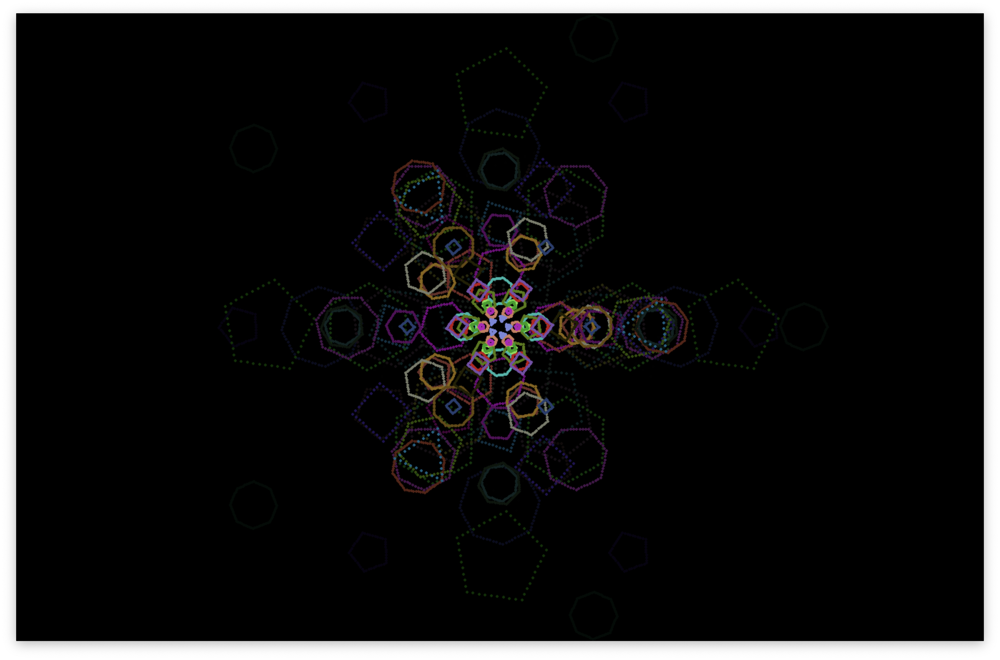

# Pygame Particle Layers

Fullscreen symmetric particle-layer animation using Pygame geometry, alpha blending and trails.

## Overview

Fullscreen animated geometric particle layers with rotations, scaling, opacity and trails.

## Features

Animation timestep, geometry, alpha blending, layered rendering.

## Tech Stack

Python / Pygame

## Preview

The actual Pygame window running its layered particle animation on macOS.

## Getting Started

Requires Python and Pygame. In a virtual environment, install Pygame with `python -m pip install pygame`, then run `python particle.py`. The program opens a fullscreen display. Use the source-defined exit control (Escape or window close).

## Validation

Lightweight local checks: Python syntax. Compilation and syntax checks do not verify application behavior. Source is preserved; interactive application behavior was not executed during archival.

## Notes

Original implementation is preserved. Build outputs, dependencies, machine-specific IDE state, backups, submission documents and private runtime data are excluded. No license has been inferred for the original work.
